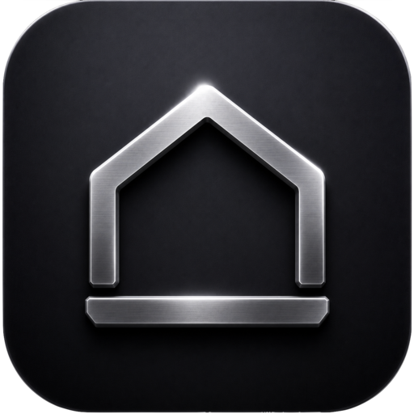

# Base

Base is a personal command center for planning, focus, money, notes, projects,
and AI-assisted daily work. It includes a Next.js web app plus native
SwiftUI apps for iPhone and Mac. The native apps keep a local copy of Base data,
queue edits without a connection, and merge those edits when the internet returns.

## Highlights

- **Overview dashboard** - a full-width command center with greeting,
  task/project summaries, revenue target progress, portfolio trend data, and
  news briefing cards.
- **Tasks** - priority/categorised tasks, due dates, recurring settings, manual
  arrangement, subtasks, completion tracking, and native offline creation.
- **Calendar** - editable all-day and timed events, recurring series, month and
  agenda views, plus dated tasks, milestones, payments, exams, workouts, and
  optional Cal.com bookings in one schedule.
- **Focus** - deep-work timer with session logging, task tags, notes, and saved
  focus history.
- **Projects** - active/on-hold/done project tracking with categories, logos,
  milestones, notes, documents, files, links, and detail pages.
- **Notes** - block-based wiki with folders, nested pages, rich blocks, page
  locks, trash/restore, print/export helpers, graph view, and native offline notes.
- **Vision board** - full-bleed canvas for photos, notes, music cards, drawings,
  shapes, arrows, undo/redo, board switching, and image uploads.
- **Finance** - income/spend ledger, daily revenue target, subscriptions, wallet
  balances, token data, FX conversion, and portfolio snapshots.
- **News** - RSS/live news, market cards, AI-written briefings, creator feeds,
  Reddit/X preferences, and live status checks. This is the only AI surface in
  the app today - the old standalone AI chat was removed.
- **Settings** - appearance, navigation mode, accent/theme preferences, personal
  AI context, news/feed sources, and local app preferences.
- **Command palette** - `Cmd+K` search across pages, projects, notes, boards,
  wiki pages, and common actions.
- **Site-wide keyboard shortcuts** - navigate with `g`+key, create from anywhere
  with `Cmd+Shift+N/O/E`, and flip theme, sidebar, and navigation mode on the
  spot. Press `?` for the full sheet. See [Keyboard Shortcuts](#keyboard-shortcuts).
- **First-run onboarding** - a one-time setup wizard collects a name, timezone,
  password, and the pages you actually want, then takes you straight to work.
- **Native iPhone support** - SwiftUI dashboard, tasks, projects, notes, habits,
  focus, finance, cached news, offline mutation queue, and WidgetKit home-screen
  widget.
- **Mac support** - the complete live Base interface in a native window, a
  SwiftUI offline fallback, a reliable `Control+Option+Space` global shortcut,
  Spotlight/Dock install flow, and Sparkle updates.
- **Backend integrations** - Upstash Redis/KV persistence, Vercel Blob uploads,
  Gemini, Perplexity, Cal.com, wallet/token APIs, cron snapshots, and an
  OAuth-capable MCP server.

## Tech Stack

- **Framework:** Next.js 16 App Router, React 19, TypeScript
- **Styling:** Tailwind CSS v4 with custom monochrome/liquid-glass tokens
- **Storage:** Upstash Redis/KV for app state, Vercel Blob for uploads
- **Native:** SwiftUI and WidgetKit for iPhone, SwiftUI/WebKit hybrid for Mac,
  Network framework reconnect detection, Sparkle for Mac updates
- **AI/search:** Gemini, Perplexity, optional local CLI/Ollama relay (`scripts/base-cli.mjs`)
- **Deployment:** Vercel with daily cron snapshots

> This repo uses a Next.js version with breaking changes. Before changing
> Next-specific routing, request APIs, proxy behavior, or build configuration,
> read the relevant guide in `node_modules/next/dist/docs/`.

## Project Structure

```text
app/
  (app)/                 Authenticated dashboard routes
  api/                   Route handlers, integrations, MCP, cron, widgets
  login/                 Password login
components/              Page components, navigation, command palette, UI
lib/                     Store, contexts, sessions, AI context, utilities
public/                  Brand assets and PWA manifest
native/BaseCore/         Shared native models, offline store, sync queue, and views
ios/                     Native SwiftUI iOS project and Base Widget extension
macos/                   macOS WebKit host, offline fallback, and Sparkle config
scripts/                 Native install/release helpers, base-cli.mjs local relay
docs/                    iOS/macOS app notes
```

## Getting Started

Install dependencies:

```bash
npm install
```

Run the web app locally:

```bash
npm run dev
```

Open `http://localhost:3000`.

Build for production:

```bash
npm run build
```

Run static checks and tests:

```bash
npm run lint
npx tsc --noEmit
npm test
```

## Keyboard Shortcuts

`KeyboardShortcuts` is mounted once in the app layout, so these work on every
page. Press `?` in the app to see this list in a cheat-sheet. Shortcuts are
ignored while you're typing in a field, and unknown combos are left to the
browser (so `Cmd+F`, `Cmd+P`, `Cmd+R` still behave normally).

| Keys | Action |
| --- | --- |
| `Cmd/Ctrl + K` | Search / command palette |
| `?` | Toggle the shortcut sheet |
| `g` then `d j v n a t w e m o f r s` | Jump to dashboard, projects, vision, notes, calendar, tasks, shopping, reading, watch, focus, finance, news, settings |
| `Cmd/Ctrl + Shift + N` | New task |
| `Cmd/Ctrl + Shift + O` | New project |
| `Cmd/Ctrl + Shift + E` | New calendar event |
| `Cmd/Ctrl + Shift + D` | Toggle dark / light mode |
| `Cmd/Ctrl + \` | Switch between sidebar and dock navigation |
| `Cmd/Ctrl + B` | Collapse / expand the sidebar |

On the notes page, `Cmd+N` is a new note and `Cmd+Z` / `Cmd+Shift+Z` are
undo/redo - those are handled by the editor, so the combos above avoid them.

To add a shortcut, register it in `COMBOS` in `components/keyboard-shortcuts.tsx`
and add the matching row in `lib/shortcuts.ts`; the cheat-sheet renders straight
from that registry, so it never needs editing.

## Naming and legacy keys

Base was Nexus, then Bridge, and is now Base. Data keys, env vars, and cookies
were renamed, but **nothing was dropped**: each rename reads the new name first,
falls back to the old one, and copies the value forward on first read. Upgrading
therefore never loses data and never signs anyone out.

| What | Current | Still read |
| --- | --- | --- |
| Redis data | `base:data` | `bridge:data`, `nexus:data` |
| Redis revision | `base:data:revision` | `bridge:data:revision`, `nexus:data:revision` |
| Redis history | `base:data:history` | `bridge:data:history` |
| Redis password verifier | `base:auth:password` | `bridge:auth:password` |
| Redis news cache | `base:news:summary:*` | - (a cache; a miss just re-fetches) |
| localStorage document | `base_data` | `bridge_data`, `nexus_data` |
| Session cookie | `base_auth` | `bridge_auth` (old cookie is cleared on next login) |
| Native handoff flags | `base_open_new_task`, `base_open_new_project` | `bridge_open_new_task`, `bridge_open_new_project` |
| Widget auth header | `x-base-token` | `x-bridge-token` |
| Local relay token | `BASE_CLI_TOKEN` | `BRIDGE_CLI_TOKEN` |

The native handoff flags and the widget header are a live contract with builds
users have already installed, so the **macOS app writes both** flag names and the
server accepts both headers until no supported client still emits the old one.

Two things are deliberately **not** renamed, because they are identity rather than
branding:

- **Bundle identifiers** - `app.bridge.personal`, `app.bridge.personal.mac`, and
  `app.bridge.personal.BridgeWidget`. A different bundle ID is a different app:
  existing installs would stop receiving updates. Change these only as a
  deliberate migration, not as part of a rename.
- **The Sparkle feed** - the macOS update feed still points at
  `Browny01/bridge-mac-releases`, which is a published endpoint.

## Environment Variables

Base can boot with partial configuration, but the production app expects these
variables depending on the feature set you want enabled:

| Variable | Used for |
| --- | --- |
| `BASE_PASSWORD` | Password login; falls back to the project default if unset |
| `BASE_PASSWORD_HASH` | scrypt hash of the login password (plaintext never needed) |
| `BASE_SESSION_SECRET` | HMAC session cookie signing |
| `BASE_AGENT_TOKEN` | Agent/task API authentication |
| `MCP_TOKEN` | MCP server authentication |
| `CRON_SECRET` | Daily snapshot cron authorization |
| `KV_URL`, `REDIS_URL` | Upstash Redis/KV compatibility URLs |
| `KV_REST_API_URL`, `KV_REST_API_TOKEN`, `KV_REST_API_READ_ONLY_TOKEN` | Redis REST access |
| `BLOB_READ_WRITE_TOKEN` | Vercel Blob file uploads |
| `GEMINI_API_KEY` | News briefing, learning, and summaries |
| `PERPLEXITY_API_KEY` | Web search and live news lookups |
| `STRIPE_SECRET_KEY` | Stripe revenue/business stats |
| `CALCOM_API_KEY` | Cal.com bookings |
| `BASE_CLI_TOKEN` | Optional local CLI/Ollama relay auth |
| `BASE_ALLOWED_ORIGIN` | Optional local relay origin allowlist |
| `BASE_OLLAMA_URL` | Optional local Ollama endpoint |

Every `BASE_*` variable above also accepts its older `BRIDGE_*` (and, for some,
`NEXUS_*`) name as a fallback, so an existing deployment keeps working without a
flag day. New variables should be added as `BASE_*` only. See
[Naming and legacy keys](#naming-and-legacy-keys).

Keep env files local. `.env*` and `.vercel/` are intentionally gitignored.

## Native iOS App

The iPhone app is a real SwiftUI client, not a web view. It opens from local data,
so tasks, projects, notes, habits, focus sessions, and finance entries remain usable
without internet. Each change is written to disk immediately and added to a durable
operation queue. On reconnect, `/api/native/sync` atomically merges those record
changes into the main Base document and downloads the latest state.

```bash
npm run ios   # open ios/App/App.xcodeproj
```

Choose the `App` scheme and your signing team in Xcode, then run on a simulator or
connected iPhone. The project also includes the `BaseWidget` WidgetKit extension.
See `docs/ios-app.md` for signing, offline behavior, and installation details.

## macOS App

The macOS app renders the production Base website directly, so it has the same
layout, routes, and functionality as Base in a browser. If the website cannot
be reached, it switches to the shared native workspace; offline edits are queued
and synchronized after reconnecting. Press `Control+Option+Space` from any app to
bring Base forward. Sparkle distributes Mac app updates.

Useful commands:

```bash
npm run mac:gen       # generate macOS Xcode project with XcodeGen
npm run mac           # generate and open the project
npm run mac:install   # build Release and install Base.app to /Applications
npm run mac:release   # build/sign/publish a Sparkle update
```

See `docs/macos-app.md` for release details.

## Deployment

The production app is deployed on Vercel as a Next.js project. `vercel.json`
declares the framework and schedules the daily snapshot cron:

```json
{
  "framework": "nextjs",
  "crons": [{ "path": "/api/cron/snapshot", "schedule": "0 12 * * *" }]
}
```

Connect the Vercel project to GitHub for automatic web/API deployments. Native app
code ships separately through Xcode/TestFlight on iOS and Sparkle on macOS. The
native clients use the deployed API for synchronization and news refreshes.

## Available Scripts

| Script | Purpose |
| --- | --- |
| `npm run dev` | Start the Next.js dev server |
| `npm run build` | Create a production Next.js build |
| `npm run start` | Start the production server |
| `npm run lint` | Run ESLint |
| `npm test` | Run the Node test suite |
| `npm run ios` | Open the native iOS project |
| `npm run mac:gen` | Generate the macOS Xcode project |
| `npm run mac` | Generate and open the macOS project |
| `npm run mac:install` | Install the macOS app locally |
| `npm run mac:release` | Publish a native macOS Sparkle update |

## Notes for Contributors

- Prefer the existing page/component/store patterns before adding new
  abstractions.
- Do not commit secrets, `.vercel/`, local env files, native build output, or
  generated caches.
- Put shared iOS/macOS data behavior and screens in `native/BaseCore`; keep only
  platform lifecycle and shortcut code in the platform folders.
- Preserve unknown JSON fields when extending native sync so older clients cannot
  erase newer web-only data.
- Verify both native targets after shared Swift changes.
- When changing the macOS shell source, regenerate the project from
  `macos/project.yml` rather than hand-editing generated project files.

## Roadmap

- **Habits & streaks** - habit tracking with week/habit calendar views,
  completion streaks, and gentle reminders on web and native.
- **Offline-first sync v2** - conflict-aware merges with field-level resolution
  and end-to-end encryption for local native data.
- **AI planning agent** - turn a project goal into a dated, prioritized task plan
  using Gemini and pull results back into the calendar. This is the intended
  successor to the retired AI chat.
- **Widgets & watch** - additional WidgetKit variants (tasks, calendar, focus) and
  an Apple Watch companion for quick capture and glanceable summaries.
- **Multi-workspace** - multiple Base documents per account with per-workspace
  settings, themes, and sharing/read-only invites.
- **On-device privacy mode** - a local mode backed by Upstash edges where
  summaries never leave your own deployment.
- **Server-side image pipeline** - thumbnail generation, format optimization, and
  restore/trash-friendly image handling for the vision board and projects.
